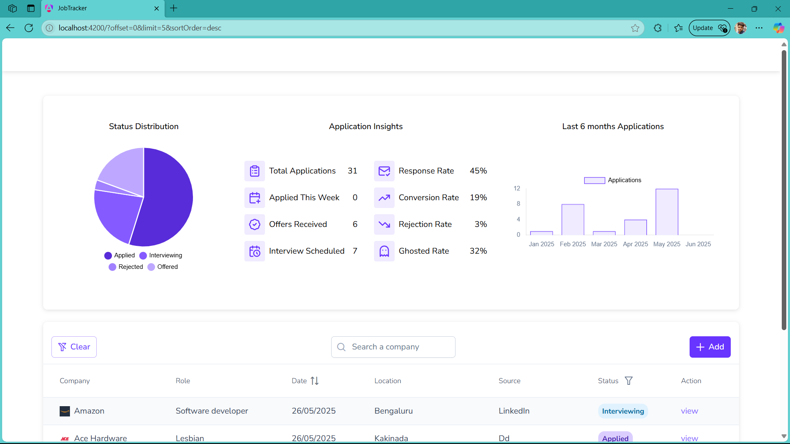
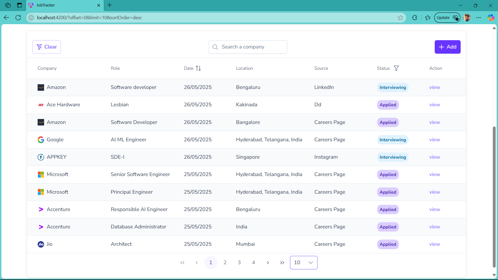
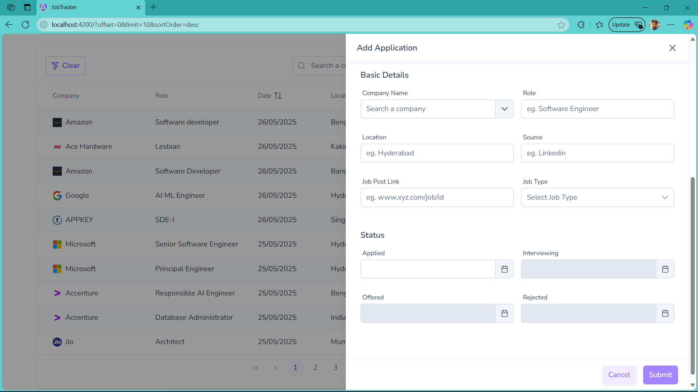
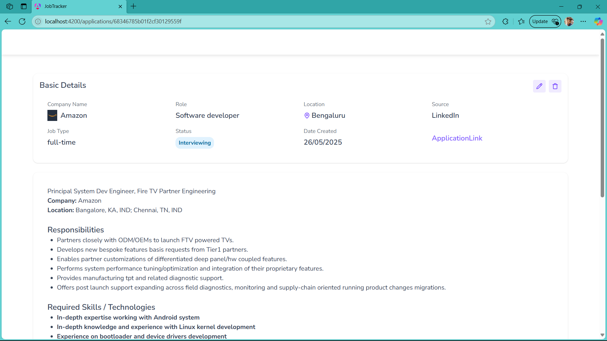
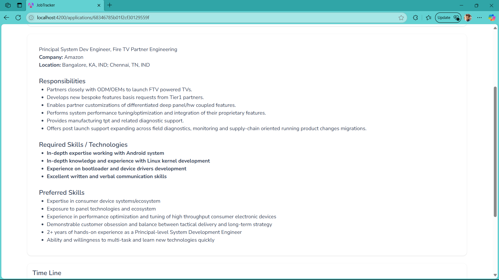
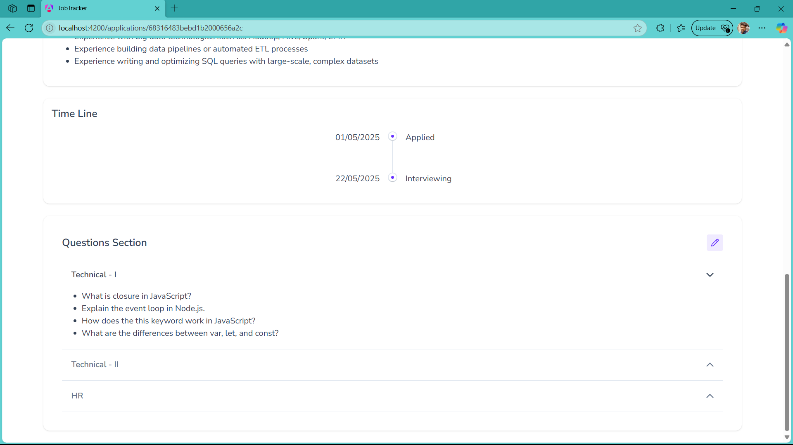
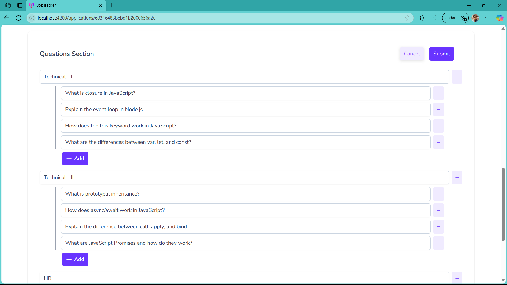

# Job Tracker

A full-stack application to manage and track job applications effectively, with features like dashboard analytics, AI-driven job post summarization, and more.

## Features

- Visual dashboard with pie and bar charts
- Searchable and filterable job table with pagination
- AI-generated job post summaries using Crawl4AI and Gemini
- Timeline and question tracking for each application
- Dockerized Node.js and Flask microservices

## Preview

## Technologies Used

- **Frontend:** Angular
- **Backend:** Node.js, Express.js, MongoDB
- **AI Integration:** Flask, Crawl4AI, Gemini AI
- **DevOps:** Docker, Docker Compose
